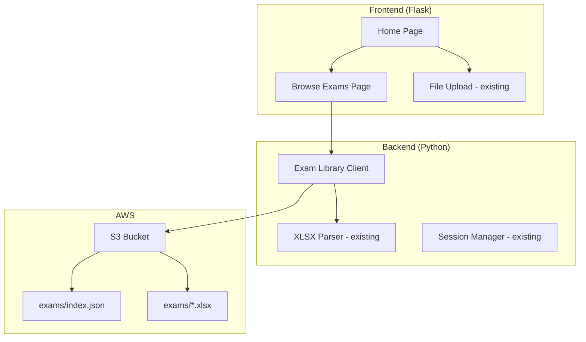

# Design Document: S3 Exam Library

## Overview

The S3 Exam Library extends the Exam Mockup Agent with a browseable catalog of pre-uploaded exam question files stored in AWS S3. Users can select exams from a list on the home page rather than uploading their own XLSX files each time. The catalog is managed through a JSON manifest file (`exams/index.json`) in S3, making it easy for administrators to add or remove exams without code changes.

## Architecture



### Flow

1. User visits home page → sees "Browse Exams" alongside upload (only if `EXAM_LIBRARY_BUCKET` is configured)
2. User clicks "Browse Exams" → backend fetches `exams/index.json` from S3 → renders exam list
3. User selects an exam → backend downloads the XLSX from S3 → parses with existing parser → proceeds to mode selection
4. From mode selection onward, the flow is identical to the upload path

## Components and Interfaces

### 1. Exam Library Client (`exam_mockup_agent/library.py`)

**Responsibility:** Fetch the manifest and exam files from S3.

**Interface:**
```python
@dataclass
class ExamEntry:
    id: str
    name: str
    provider: str
    description: str
    file_path: str
    question_count: int

@dataclass
class ExamManifest:
    exams: list[ExamEntry]

    def serialize(self) -> str:
        """Serialize manifest to JSON string."""
        ...

    @classmethod
    def deserialize(cls, json_str: str) -> "ExamManifest":
        """Deserialize JSON string to ExamManifest."""
        ...

def get_library_config() -> tuple[str | None, str]:
    """Return (bucket_name, prefix) from environment variables.
    Returns (None, prefix) if bucket is not configured."""
    ...

def fetch_manifest(bucket: str, prefix: str) -> ExamManifest:
    """Fetch and parse the exam manifest from S3.
    Raises LibraryError if manifest is missing or invalid."""
    ...

def download_exam(bucket: str, file_path: str) -> str:
    """Download an exam XLSX from S3 to a temp file.
    Returns the local temp file path.
    Raises LibraryError if file is missing."""
    ...
```

### 2. Updated Flask Routes (`flask_app.py`)

**New routes:**
```python
@app.route("/browse")
def browse_exams():
    """Display available exams from the S3 library."""
    ...

@app.route("/select-exam/<exam_id>", methods=["POST"])
def select_exam(exam_id: str):
    """Download and parse an exam from the library, then redirect to mode selection."""
    ...
```

### 3. Browse Exams Template (`templates/browse.html`)

Displays exam cards with name, provider, description, and question count. Each card has a "Start" button that triggers `/select-exam/<id>`.

### 4. Terraform Addition (`infra/s3.tf`)

S3 bucket with versioning, plus IAM policy updates for the ECS task role.

## Data Models

### ExamEntry
```python
@dataclass
class ExamEntry:
    id: str           # Unique identifier, e.g. "aws-saa-c03"
    name: str         # Display name, e.g. "AWS Solutions Architect Associate"
    provider: str     # e.g. "AWS", "Azure", "GCP"
    description: str  # Brief description
    file_path: str    # S3 key relative to prefix, e.g. "aws-saa-c03.xlsx"
    question_count: int  # Number of questions in the file
```

### ExamManifest (index.json schema)
```json
{
  "exams": [
    {
      "id": "aws-saa-c03",
      "name": "AWS Solutions Architect Associate (SAA-C03)",
      "provider": "AWS",
      "description": "Practice questions for the SAA-C03 certification exam",
      "file_path": "aws-saa-c03.xlsx",
      "question_count": 120
    }
  ]
}
```

</content>
</invoke>

## Correctness Properties

*A property is a characteristic or behavior that should hold true across all valid executions of a system-essentially, a formal statement about what the system should do. 
Properties serve as the bridge between human-readable specifications and machine-verifiable correctness guarantees.*

### Property 1: Manifest Serialization Round-Trip

*For any* valid ExamManifest containing a list of ExamEntry objects (each with non-empty id, name, provider, description, file_path, and positive question_count), serializing the manifest to JSON and then deserializing it back shall produce an ExamManifest equivalent to the original.

**Validates: Requirements 4.3**

### Property 2: Invalid Manifest Entry Rejection

*For any* JSON object representing a manifest entry that is missing one or more required fields (from the set: id, name, provider, description, file_path, question_count), the manifest parser shall raise a validation error identifying the missing fields.

**Validates: Requirements 2.2, 4.2**

## Error Handling

| Error Scenario | Handling Strategy |
|---|---|
| `EXAM_LIBRARY_BUCKET` not set | Hide "Browse Exams" option, only show upload flow |
| S3 manifest file not found | Display error message on browse page, suggest file upload |
| S3 manifest file invalid JSON | Display error message, allow fallback to upload |
| Manifest entry missing required fields | Skip invalid entry, log warning, show valid entries |
| Exam XLSX file not found in S3 | Show error for that specific exam, display remaining exams |
| S3 access denied | Display permission error, suggest checking IAM configuration |
| S3 network timeout | Display timeout error with retry suggestion |

## Testing Strategy

### Property-Based Testing

**Library:** [Hypothesis](https://hypothesis.readthedocs.io/) (Python property-based testing framework)

**Configuration:** Each property test runs a minimum of 100 iterations.

**Annotation format:** Each property-based test is tagged with a comment:
`# Feature: exam-library, Property {number}: {property_text}`

Each correctness property from the design document is implemented as a single property-based test using Hypothesis strategies to generate random valid inputs.

### Unit Testing

**Framework:** pytest

Unit tests cover:
- `get_library_config()` with various env var combinations
- Manifest parsing with valid and invalid JSON
- Edge cases: empty exams list, manifest with one entry

### Dual Approach

- Property-based tests verify universal correctness (round-trip, validation)
- Unit tests verify specific examples, edge cases, and integration points
- Together they provide comprehensive coverage

### Test File Structure

```
tests/
├── test_library.py         # Unit + property tests for exam library client
└── conftest.py             # Shared fixtures (extended with library strategies)
```
