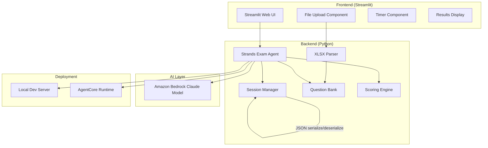
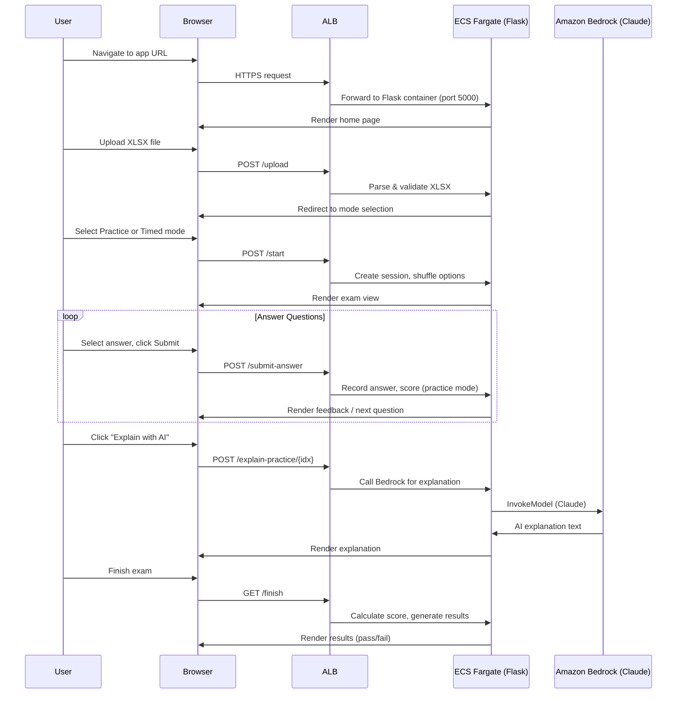
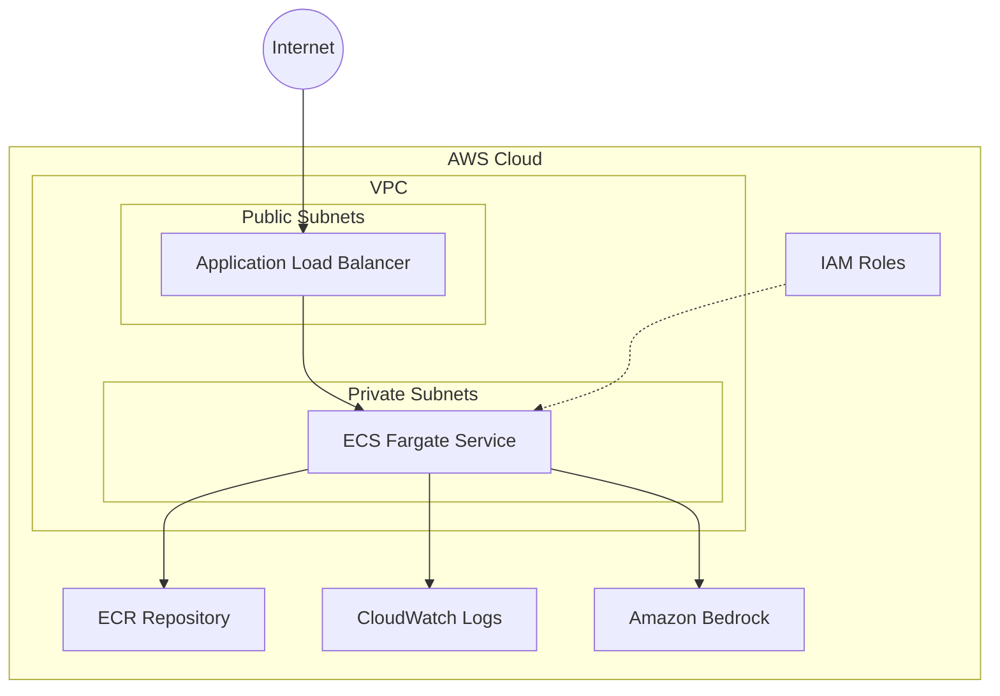
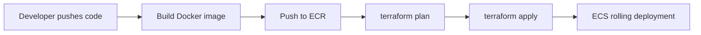

# Design Document: Exam Mockup Agent

## Overview

The Exam Mockup Agent is a cloud provider certification exam simulator built with Python (Strands Agents framework) and a Streamlit-based UI. It allows users to upload XLSX question files, practice in two modes (Practice and Timed), and get AI-powered explanations for answers. The system is designed for local-first development with a clear path to Amazon Bedrock AgentCore deployment.

## Architecture



### Deployment Architecture

**Local Mode:**
- Streamlit serves the UI on localhost
- Agent runs in-process using Strands Agents with direct Bedrock API calls
- Session state stored in-memory and optionally persisted to local JSON files

**AgentCore Mode:**
- Agent deployed as a container to AgentCore Runtime using `@app.entrypoint`
- UI deployed separately (Streamlit on EC2/ECS or as a static frontend calling the agent endpoint)
- Same core logic, different transport layer

## Components and Interfaces

### 1. XLSX Parser (`parser.py`)

**Responsibility:** Parse and validate uploaded XLSX files into a structured Question Bank.

**Interface:**
```python
@dataclass
class Question:
    id: int
    text: str
    options: dict[str, str]  # {"A": "...", "B": "...", ...}
    correct_answers: list[str]  # ["A"] or ["A", "C"]
    question_type: str  # "single" or "multiple"

def parse_xlsx(file_path: str) -> list[Question]:
    """Parse XLSX file and return list of Question objects.
    Raises ValidationError if file is invalid."""
    ...

def validate_xlsx_structure(file_path: str) -> tuple[bool, str]:
    """Validate XLSX has required columns. Returns (is_valid, error_message)."""
    ...
```

**Required columns:** Question, Option_A, Option_B, Option_C, Option_D, Correct_Answer, Question_Type
**Optional columns:** Option_E, Option_F

### 2. Session Manager (`session.py`)

**Responsibility:** Manage exam session state, including mode, progress, answers, timing, and answer option shuffling.

**Interface:**
```python
@dataclass
class ExamSession:
    session_id: str
    mode: str  # "practice" or "timed"
    questions: list[Question]
    current_index: int
    answers: dict[int, list[str]]  # question_id -> selected answers
    start_time: Optional[datetime]
    duration_minutes: int  # 120 for timed mode
    is_completed: bool
    shuffled_options: dict[int, list[str]]  # question_id -> shuffled key order e.g. ["C","A","D","B"]

    def serialize(self) -> str:
        """Serialize session to JSON string."""
        ...

    @classmethod
    def deserialize(cls, json_str: str) -> "ExamSession":
        """Deserialize JSON string to ExamSession."""
        ...

def create_practice_session(questions: list[Question]) -> ExamSession:
    ...

def create_timed_session(questions: list[Question], count: int = 60) -> ExamSession:
    ...

def shuffle_options(question: Question) -> list[str]:
    """Return a shuffled ordering of the option keys for a question.
    The correct answer mapping is preserved (answers reference original keys)."""
    ...
```

**Answer Shuffling:** When a session is created, the option display order for each question is randomized and stored in `shuffled_options`. The UI presents options in this shuffled order. User answers still reference the original option letters (A, B, C, etc.) so scoring logic remains unchanged.

### 3. Scoring Engine (`scorer.py`)

**Responsibility:** Calculate scores, determine pass/fail status, and generate result summaries.

**Interface:**
```python
PASS_THRESHOLD = 72.0  # percentage required to pass

@dataclass
class ExamResult:
    total_questions: int
    correct_count: int
    incorrect_count: int
    score_percentage: float
    passed: bool  # True if score_percentage >= PASS_THRESHOLD
    question_results: list[QuestionResult]  # per-question breakdown

@dataclass
class QuestionResult:
    question_id: int
    selected_answers: list[str]
    correct_answers: list[str]
    is_correct: bool

def calculate_score(session: ExamSession) -> ExamResult:
    ...
```

### 4. AI Explanation Agent (`agent.py`)

**Responsibility:** Use Strands Agents + Bedrock Claude to generate answer explanations.

**Interface:**
```python
def explain_answer(question: Question, selected_answers: list[str]) -> str:
    """Generate AI explanation for why the correct answer is correct
    and why incorrect options are wrong."""
    ...
```

### 5. Streamlit UI (`app.py`)

**Responsibility:** Provide the web interface for all user interactions.

**UI Layout (based on preferred design):**

```
┌─────────────────────────────────────────────────────────────────────┐
│  [G] DevOps Prep                                                    │  ← Header: App icon + name
├─────────────────────────────────────────────────────────────────────┤
│  ≡ Question 1 / 60    [PRACTICE]           │  ⊞ Question Navigator  │
│                                            │  ┌──┬──┬──┬──┬──┐     │
│  ┌─────────────────────────────────────┐   │  │1 │2 │3 │4 │5 │     │
│  │ ① Your company uses Jenkins...      │   │  ├──┼──┼──┼──┼──┤     │
│  │                                     │   │  │6 │7 │8 │9 │10│     │
│  │                                     │   │  ├──┼──┼──┼──┼──┤     │
│  │                                     │   │  │11│12│13│14│15│     │
│  │                                     │   │  ├──┼──┼──┼──┼──┤     │
│  │  ○ A. Use the Terraform module...   │   │  │..│..│..│..│..│     │
│  │                                     │   │  └──┴──┴──┴──┴──┘     │
│  │  ○ B. Confirm that the Jenkins...   │   │                        │
│  │                                     │   │  Grid colors:          │
│  │  ○ C. ...                           │   │  ■ = current (dark)    │
│  │                                     │   │  ■ = answered (blue)   │
│  │  ○ D. ...                           │   │  □ = unanswered (gray) │
│  └─────────────────────────────────────┘   │                        │
│                                            │                        │
│  [Submit Answer]  [Explain with AI]        │  [Timer: 01:58:32]     │
│                                            │  (timed mode only)     │
└────────────────────────────────────────────┴────────────────────────┘
```

**Layout Details:**
- Header bar: App avatar/icon (colored circle with initial), app name
- Sub-header: Question progress ("Question X / Y"), mode badge (PRACTICE or TIMED in blue pill)
- Main content (left ~65%): Question card with numbered circle indicator, question text, and answer options (radio buttons for single-choice, checkboxes for multiple-choice)
- Right sidebar (~35%): Question Navigator grid (5 columns), numbered buttons with color coding:
  - Dark blue filled = current question
  - Light blue filled = answered
  - Gray outline = unanswered
- Footer area: Action buttons (Submit, Explain with AI), timer display (timed mode only)

**Pages/Views:**
- Home: Upload XLSX, enter exam name, select mode (Practice / Timed)
- Exam View: Two-column layout as shown above with question card + navigator grid
- Practice Mode specifics: Immediate feedback after submit (green/red highlight), "Explain with AI" button visible after answering
- Timed Mode specifics: Countdown timer in sidebar, auto-submit on expiry
- Results: Pass/fail status banner (green PASSED or red FAILED), score summary (fraction + percentage), question grid with green/red indicators, click any question to review submitted answer vs correct answer

## Data Models

### Question Model
```python
@dataclass
class Question:
    id: int
    text: str
    options: dict[str, str]  # min 4 options (A-D), max 6 (A-F)
    correct_answers: list[str]
    question_type: str  # "single" | "multiple"
```

### ExamSession Model
```python
@dataclass
class ExamSession:
    session_id: str
    mode: str  # "practice" | "timed"
    questions: list[Question]
    current_index: int
    answers: dict[int, list[str]]
    start_time: Optional[str]  # ISO format
    duration_minutes: int
    is_completed: bool
    shuffled_options: dict[int, list[str]]  # question_id -> shuffled key order
```

### ExamResult Model
```python
@dataclass
class ExamResult:
    total_questions: int
    correct_count: int
    incorrect_count: int
    score_percentage: float
    passed: bool  # True if score_percentage >= 72.0
    question_results: list[QuestionResult]
```

### XLSX File Schema
| Column | Required | Description |
|--------|----------|-------------|
| Question | Yes | The question text |
| Option_A | Yes | First answer option |
| Option_B | Yes | Second answer option |
| Option_C | Yes | Third answer option |
| Option_D | Yes | Fourth answer option |
| Option_E | No | Fifth answer option |
| Option_F | No | Sixth answer option |
| Correct_Answer | Yes | Single letter or comma-separated letters (e.g., "A" or "A,C") |
| Question_Type | Yes | "single" or "multiple" |


## Correctness Properties

*A property is a characteristic or behavior that should hold true across all valid executions of a system-essentially, a formal statement about what the system should do. 
Properties serve as the bridge between human-readable specifications and machine-verifiable correctness guarantees.*

### Property 1: XLSX Parsing Round-Trip

*For any* valid list of Question objects (with 4-6 options, single or multiple correct answers, and valid question types), writing them to an XLSX file and then parsing that file back should produce an equivalent list of Question objects with all fields preserved.

**Validates: Requirements 1.1, 1.2, 1.3, 7.1, 7.2, 7.3**

### Property 2: Invalid XLSX Rejection with Column Identification

*For any* XLSX file that is missing one or more required columns (from the set: Question, Option_A, Option_B, Option_C, Option_D, Correct_Answer, Question_Type), the parser shall raise a validation error whose message contains the names of all missing columns.

**Validates: Requirements 1.5**

### Property 3: Session Creation Invariants

*For any* Question Bank with N questions (N >= 1), creating a timed session shall select exactly min(60, N) questions and set duration to 120 minutes, while creating a practice session shall include all questions and set no time constraint (duration = 0).

**Validates: Requirements 2.1, 3.1, 3.5**

### Property 4: Scoring Correctness

*For any* completed ExamSession with answers, the scoring engine shall produce results where: (a) correct_count + incorrect_count equals total_questions, (b) score_percentage equals (correct_count / total_questions) * 100, (c) each question is marked correct if and only if the selected answers exactly match the correct answers, and (d) passed is True if and only if score_percentage >= 72.0.

**Validates: Requirements 2.2, 2.4, 6.1, 6.2, 6.4**

### Property 5: Session Serialization Round-Trip

*For any* valid ExamSession object, serializing to JSON and then deserializing back shall produce an ExamSession equivalent to the original (all fields preserved including questions, answers, mode, timing, and completion state).

**Validates: Requirements 8.1, 8.2, 8.3**

### Property 6: Answer Shuffling Preserves Content

*For any* Question with N options, shuffling the option order shall produce a permutation that contains exactly the same set of option keys and values as the original, with no options added or removed.

**Validates: Requirements 1.6**

### Property 7: Pass/Fail Threshold Consistency

*For any* completed ExamSession, the `passed` field in ExamResult shall be True if and only if `score_percentage >= 72.0`.

**Validates: Requirements 6.4**

## End-to-End User Experience

### User Flow



### Deployment Modes

| Mode | Frontend | Backend | AI Layer | Session Storage |
|------|----------|---------|----------|-----------------|
| Local Dev | Flask on localhost:5001 | In-process Python | Bedrock API (direct) | Filesystem sessions |
| AWS Production | ALB → ECS Fargate | Flask container | Bedrock API (IAM role) | Filesystem sessions (ephemeral) |
| AgentCore (headless) | None (API only) | AgentCore Runtime | Bedrock (managed) | In-memory |

## Infrastructure Architecture (Terraform)

### Overview

The infrastructure is defined using Terraform (HCL) to deploy the Flask web application as a containerized service on ECS Fargate behind an Application Load Balancer. Terraform provides declarative, cloud-agnostic IaC with a mature AWS provider, state management, and plan/apply workflow for safe deployments.

### Stack Diagram



### Terraform Resources

**`infra/main.tf`** — Primary configuration containing:

| Resource | Terraform Resource Type | Purpose |
|----------|------------------------|---------|
| VPC | `aws_vpc`, `aws_subnet`, `aws_nat_gateway` | Network isolation with public + private subnets (2 AZs) |
| ECR Repository | `aws_ecr_repository` | Store Docker images for the Flask app |
| ECS Cluster | `aws_ecs_cluster` | Fargate cluster for running containers |
| Task Definition | `aws_ecs_task_definition` | Container config (512 CPU, 1024 MB memory) |
| ECS Service | `aws_ecs_service` | Service with desired count, deployment config |
| ALB | `aws_lb`, `aws_lb_target_group`, `aws_lb_listener` | Load balancer with health checks |
| IAM Task Role | `aws_iam_role`, `aws_iam_role_policy` | Grants `bedrock:InvokeModel` on the Claude model |
| CloudWatch Log Group | `aws_cloudwatch_log_group` | Centralized logging with 30-day retention |
| Security Groups | `aws_security_group` | Allow inbound 80/443 (ALB), ECS from ALB only |
| Auto Scaling | `aws_appautoscaling_target`, `aws_appautoscaling_policy` | Scale 1-3 tasks at 70% CPU |

### Terraform Project Structure

```
infra/
├── main.tf                   # Provider config, VPC, networking
├── ecs.tf                    # ECS cluster, task definition, service
├── alb.tf                    # Load balancer, target group, listener
├── iam.tf                    # IAM roles and policies
├── ecr.tf                    # ECR repository
├── variables.tf              # Input variables (region, app name, etc.)
├── outputs.tf                # Output values (ALB DNS, ECR URL)
├── terraform.tfvars          # Default variable values
└── backend.tf                # Remote state config (S3 + DynamoDB)
```

### Key Configuration

```hcl
# variables.tf
variable "aws_region" {
  default = "us-east-1"
}

variable "app_name" {
  default = "exam-mockup-agent"
}

variable "container_port" {
  default = 5000
}

variable "cpu" {
  default = 512
}

variable "memory" {
  default = 1024
}

variable "min_capacity" {
  default = 1
}

variable "max_capacity" {
  default = 3
}

variable "target_cpu_utilization" {
  default = 70
}
```

```hcl
# ECS task definition (ecs.tf)
resource "aws_ecs_task_definition" "app" {
  family                   = var.app_name
  network_mode             = "awsvpc"
  requires_compatibilities = ["FARGATE"]
  cpu                      = var.cpu
  memory                   = var.memory
  execution_role_arn       = aws_iam_role.ecs_execution.arn
  task_role_arn            = aws_iam_role.ecs_task.arn

  container_definitions = jsonencode([{
    name  = var.app_name
    image = "${aws_ecr_repository.app.repository_url}:latest"
    portMappings = [{ containerPort = var.container_port }]
    environment = [
      { name = "AWS_DEFAULT_REGION", value = var.aws_region }
    ]
    secrets = [
      { name = "FLASK_SECRET_KEY", valueFrom = aws_ssm_parameter.flask_secret.arn }
    ]
    logConfiguration = {
      logDriver = "awslogs"
      options = {
        "awslogs-group"         = aws_cloudwatch_log_group.app.name
        "awslogs-region"        = var.aws_region
        "awslogs-stream-prefix" = "ecs"
      }
    }
  }])
}
```

### IAM Policy (Task Role)

```hcl
resource "aws_iam_role_policy" "bedrock_access" {
  name = "bedrock-invoke"
  role = aws_iam_role.ecs_task.id

  policy = jsonencode({
    Version = "2012-10-17"
    Statement = [{
      Effect   = "Allow"
      Action   = ["bedrock:InvokeModel"]
      Resource = "arn:aws:bedrock:us-east-1::foundation-model/us.anthropic.claude-sonnet-4-20250514"
    }]
  })
}
```

### Deployment Workflow



**Deploy commands:**
```bash
# First time setup
cd infra
terraform init
terraform plan

# Deploy infrastructure
terraform apply

# Build and push Docker image
AWS_ACCOUNT_ID=$(aws sts get-caller-identity --query Account --output text)
ECR_URL=$(terraform output -raw ecr_repository_url)
docker build -t $ECR_URL:latest ..
aws ecr get-login-password --region us-east-1 | docker login --username AWS --password-stdin $ECR_URL
docker push $ECR_URL:latest

# Force new ECS deployment (picks up new image)
aws ecs update-service --cluster exam-mockup-agent --service exam-mockup-agent --force-new-deployment
```

### State Management

- Remote state stored in S3 with DynamoDB locking
- State encryption at rest via S3 bucket encryption
- Plan output reviewed before apply for safe changes

### Network Configuration

- VPC with 2 Availability Zones
- Public subnets: ALB (internet-facing)
- Private subnets: ECS tasks (no direct internet access, NAT gateway for outbound to Bedrock)
- Security group: ALB allows inbound 80/443 from 0.0.0.0/0; ECS allows inbound only from ALB security group

## Error Handling

| Error Scenario | Handling Strategy |
|---|---|
| Invalid XLSX file (corrupted) | Catch `openpyxl` exceptions, return user-friendly error with file issue description |
| Missing required columns | Validate column headers before parsing, return list of missing columns |
| Invalid Correct_Answer values | Validate answer letters exist in options, reject with specific error |
| Invalid Question_Type values | Validate against allowed values ("single", "multiple"), reject with error |
| Question Bank too small for timed mode | Use all available questions, display warning to user |
| Session deserialization failure | Catch JSON/validation errors, inform user session is corrupted |
| Bedrock API failure (AI explanation) | Retry once, then display fallback message asking user to try again |
| Timer expiry during answer submission | Accept the in-flight submission, then end session |
| ECS health check failure | ALB drains connections, ECS replaces unhealthy task automatically |
| Terraform apply failure | State locks prevent concurrent changes; manual intervention to fix or rollback |
| ECR image push failure | Deployment blocked; no change to running service |

## Testing Strategy

### Property-Based Testing

**Library:** [Hypothesis](https://hypothesis.readthedocs.io/) (Python property-based testing framework)

**Configuration:** Each property test runs a minimum of 100 iterations.

**Annotation format:** Each property-based test is tagged with a comment:
`# Feature: exam-mockup-agent, Property {number}: {property_text}`

Each correctness property from the design document is implemented as a single property-based test using Hypothesis strategies to generate random valid inputs.

### Unit Testing

**Framework:** pytest

Unit tests cover:
- Specific edge cases (empty question bank, single question, exactly 60 questions)
- Timer expiry boundary conditions
- XLSX files with optional columns (Option_E, Option_F)
- Scoring with all-correct and all-incorrect scenarios

### Dual Approach

- Property-based tests verify universal correctness across all valid inputs
- Unit tests verify specific examples, edge cases, and integration points
- Together they provide comprehensive coverage: properties catch general bugs, unit tests catch concrete edge cases

### Test File Structure

```
tests/
├── test_parser.py          # Unit + property tests for XLSX parsing
├── test_session.py         # Unit + property tests for session management
├── test_scorer.py          # Unit + property tests for scoring
└── conftest.py             # Shared fixtures and Hypothesis strategies
```
